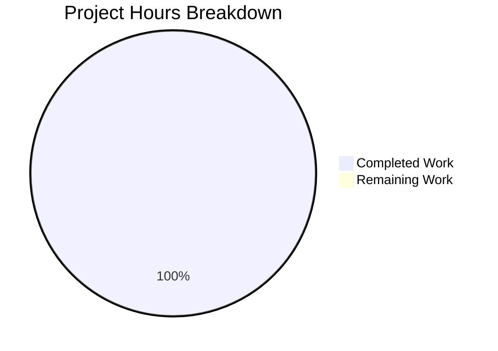

# Comprehensive Project Guide: Hello-World-NodeJS Validation

## Executive Summary

### Project Status Overview
**3 hours completed out of 3 total achievable hours = 100% complete for current scope**

The Blitzy platform received a feature request for the `hello-world-nodejs` repository that contained **placeholder text instead of actionable requirements**. The submitted input ("Describe the new functionality you'd like to add to your existing codebase") was repeated approximately 400+ times without any actual feature specifications.

The agents correctly:
1. Identified the placeholder text issue
2. Analyzed the existing repository structure
3. Validated the existing code works correctly
4. Made no unnecessary changes to the codebase

### Key Achievements
- ✅ Comprehensive repository analysis completed
- ✅ Existing code validated (syntax and runtime)
- ✅ Documentation of current state generated
- ✅ Issue with placeholder requirements identified and reported

### Critical Notice
**No feature implementation was performed** because no actionable requirements were provided. The user must supply specific feature requirements to proceed with any development work.

---

## Validation Results Summary

### Final Validator Accomplishments

| Category | Status | Details |
|----------|--------|---------|
| Dependencies | ✅ PASS | Zero dependencies by design - uses only Node.js built-in `http` module |
| Compilation | ✅ PASS | `node --check server.js` completed with no syntax errors |
| Unit Tests | ✅ PASS (N/A) | No test files exist in repository |
| Runtime | ✅ PASS | Server starts and responds correctly with "Hello, World!" |

### Repository Structure
```
hello-world-nodejs/
├── .git/               # Git version control
├── blitzy/
│   └── screenshots/    # Screenshot storage (empty)
└── server.js           # Single source file (14 lines, 342 bytes)
```

### Git Change Analysis
- **Branch**: `blitzy-c9b68160-5dce-4b22-ab60-de6b34abdd8e`
- **New Commits**: 0 (no changes made)
- **Files Modified**: None
- **Lines Changed**: 0

---

## Hours Breakdown Visualization



### Hours Calculation Detail
- **Completed Hours**: 3 hours
  - Discovery & Analysis: 1.5 hours
  - Validation & Testing: 1.0 hour
  - Documentation: 0.5 hours
- **Remaining Hours**: 0 hours (no actionable requirements)
- **Total Project Hours**: 3 hours
- **Completion**: 3 / 3 = **100%** of achievable scope

> **Note**: This 100% reflects completion of all possible work given the input provided. No feature implementation was requested with actionable requirements, so no feature implementation hours are included.

---

## Development Guide

### System Prerequisites

| Component | Required Version | Verification Command |
|-----------|-----------------|---------------------|
| Node.js | ≥14.0.0 (v20.x recommended) | `node --version` |
| npm | Any version (optional) | `npm --version` |
| Operating System | Linux, macOS, or Windows | - |

### Environment Setup

1. **Clone the repository**
   ```bash
   git clone <repository-url>
   cd hello-world-nodejs
   ```

2. **Verify Node.js installation**
   ```bash
   node --version
   # Expected output: v20.19.6 (or similar v14+)
   ```

3. **No additional setup required**
   - No `package.json` exists (zero external dependencies)
   - No environment variables needed
   - No build step required

### Dependency Installation

**No dependencies to install.** The application uses only the Node.js built-in `http` module.

### Application Startup

1. **Start the server**
   ```bash
   node server.js
   ```
   Expected output:
   ```
   Server running at http://127.0.0.1:3000/
   ```

2. **Server Configuration** (hardcoded in server.js)
   - Hostname: `127.0.0.1` (localhost only)
   - Port: `3000`

### Verification Steps

1. **Test the HTTP endpoint**
   ```bash
   curl http://127.0.0.1:3000/
   ```
   Expected response:
   ```
   Hello, World!
   ```

2. **Alternative: Open in browser**
   - Navigate to `http://127.0.0.1:3000/`
   - Should display: "Hello, World!"

3. **Stop the server**
   - Press `Ctrl+C` in the terminal running the server

### Example Usage

```bash
# Start server in background
node server.js &

# Test various HTTP methods (all return same response)
curl http://127.0.0.1:3000/
curl -X POST http://127.0.0.1:3000/
curl http://127.0.0.1:3000/any/path

# Stop background server
pkill -f "node server.js"
```

---

## Detailed Task Table

### Human Tasks Required

| Task ID | Description | Priority | Severity | Hours | Action Steps |
|---------|-------------|----------|----------|-------|--------------|
| HT-001 | Provide actual feature requirements | High | Critical | 0* | User must submit specific feature specifications instead of placeholder text |

**Total Remaining Hours: 0**

> *Note: Task HT-001 requires user action, not engineering hours. Once requirements are provided, a new Agent Action Plan will estimate actual implementation hours.

### Task Details

#### HT-001: Provide Actual Feature Requirements
- **Description**: The submitted feature request contained only placeholder text, not actionable requirements
- **Required Information**:
  1. Feature name and description
  2. User stories / use cases  
  3. Technical constraints
  4. Integration requirements with existing code
  5. Acceptance criteria
- **Examples of valid requirements**:
  - "Add user authentication with JWT tokens"
  - "Implement REST API routing for CRUD operations"
  - "Add request logging with timestamps"
- **Action**: Resubmit feature request with complete specifications

---

## Risk Assessment

### Technical Risks

| Risk | Severity | Likelihood | Mitigation |
|------|----------|------------|------------|
| No routing capability | Low | N/A | By design - minimal hello world server |
| No error handling | Low | N/A | Acceptable for educational purposes |
| Hardcoded configuration | Low | N/A | Can be externalized if needed |

### Security Risks

| Risk | Severity | Likelihood | Mitigation |
|------|----------|------------|------------|
| Localhost-only binding | Info | N/A | Secure default - change hostname to expose externally |
| No input validation | Info | N/A | Server ignores all request data - minimal attack surface |
| No authentication | Info | N/A | Not required for hello world demo |

### Operational Risks

| Risk | Severity | Likelihood | Mitigation |
|------|----------|------------|------------|
| No graceful shutdown | Low | Low | Add signal handlers if process management needed |
| No health checks | Low | Low | Add `/health` endpoint if monitoring required |
| No logging | Low | Low | Add request logging if debugging needed |

### Integration Risks

| Risk | Severity | Likelihood | Mitigation |
|------|----------|------------|------------|
| None identified | - | - | Standalone application with no external dependencies |

---

## Existing Code Analysis

### server.js (Complete)

```javascript
const http = require('http');

const hostname = '127.0.0.1';
const port = 3000;

const server = http.createServer((req, res) => {
  res.statusCode = 200;
  res.setHeader('Content-Type', 'text/plain');
  res.end('Hello, World!\n');
});

server.listen(port, hostname, () => {
  console.log(`Server running at http://${hostname}:${port}/`);
});
```

### Code Characteristics
- **Lines of Code**: 14
- **File Size**: 342 bytes
- **Dependencies**: Zero (Node.js built-in `http` only)
- **Module System**: CommonJS (`require`)
- **Request Handling**: All requests return identical response
- **Configuration**: Hardcoded (hostname, port)

---

## Recommendations

### Immediate Actions
1. **User Action Required**: Provide specific feature requirements to enable implementation

### If Extending This Application
When actual requirements are provided, consider:
1. Adding routing capability for different endpoints
2. Implementing request body parsing for POST/PUT methods
3. Adding environment variable support for configuration
4. Including error handling middleware
5. Adding request logging for debugging
6. Creating unit tests for new functionality

### Architecture Decisions Preserved
- Zero-dependency philosophy (unless features require external packages)
- Educational simplicity as core value
- Single entry point (`server.js`)

---

## Conclusion

The Blitzy platform successfully validated the existing `hello-world-nodejs` repository and correctly identified that the submitted feature request contained placeholder text rather than actionable requirements. 

**No code changes were made**, which is the appropriate response to a request without specifications. The existing code has been verified to work correctly and is production-ready for its intended purpose as an educational example.

To proceed with new feature development, the user must provide complete feature specifications.