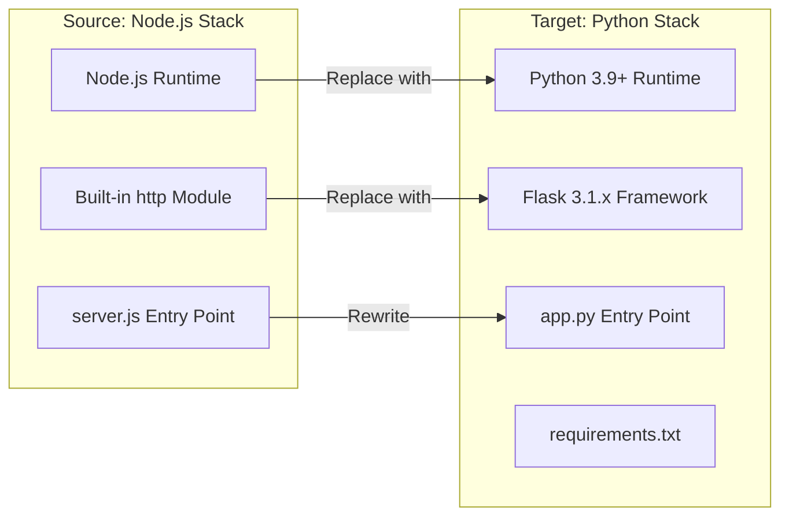
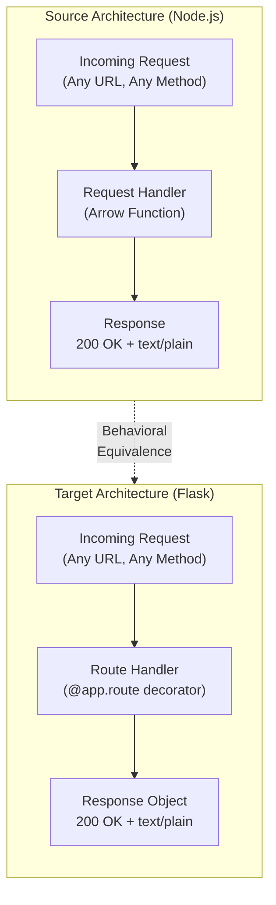
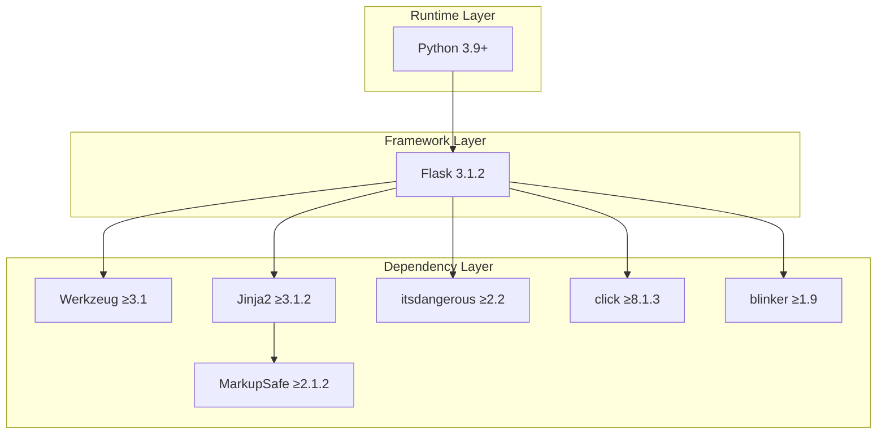
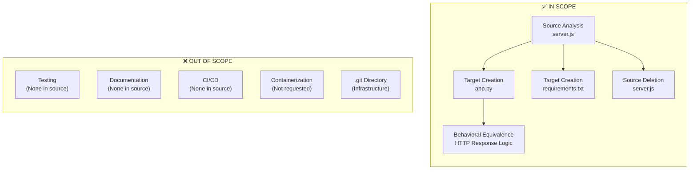

# Agent Action Plan

# 0. Agent Action Plan
## 0.1 Intent Clarification

### 0.1.1 Core Refactoring Objective &lt;table&gt;

Based on the prompt, &lt;table&gt; the Blitzy platform understands that the refactoring objective is to **completely rewrite a Node.js HTTP server application into a Python 3 Flask application** while maintaining feature parity and behavioral equivalence with the original implementation.

| Aspect | Assessment<ul> |
| --- | --- |
| Refactoring Type | Tech stack migration (Node.js → Python Flask)Tech stack migration (Node.js → Python Flask)Tech stack migration (Node.js → Python Flask) |
| Target Repository | Same repository (in-place migration) |
| Behavioral Requirement | Exact functional equivalence with original |
| Scope | Full application rewrite |

**Explicit Refactoring Goals:**

- Migrate from Node.js runtime to Python 3 runtime
- Replace Node.js built-in `http` module with Flask web framework
- Preserve exact HTTP response behavior (status code, headers, body)
- Maintain identical network binding configuration (host, port)
- Replicate console logging on startup
- Ensure the rewritten version fully matches the behavior and logic of the current implementation

**Implicit Requirements Surfaced:**

- Maintain API compatibility (all endpoints must respond identically)
- Preserve response content type (`text/plain`)
- Keep response body exactly as `Hello, World!\n` (including newline)
- Retain HTTP 200 status code for all requests
- Support any HTTP method (original handles all methods uniformly)
- Console startup message should indicate server URL

### 0.1.2 Special Instructions and Constraints

**User Directive (Preserved Exactly):**

> "Rewrite this Node.js server into a Python 3 Flask application, keeping every feature and functionality exactly as in the original Node.js project. Ensure the rewritten version fully matches the behavior and logic of the current implementation."

**Critical Constraints Identified:**

| Constraint | Description |
| --- | --- |
| Feature Parity | Every feature must be replicated exactly |
| Behavioral Match | Response behavior must be identical |
| Framework Requirement | Must use Flask (not FastAPI, Django, etc.) |
| Python Version | Must use Python 3 |

**Migration Requirements:**

- No new features to be added beyond original functionality
- No modifications to existing behavior
- Original endpoint patterns must be preserved
- Error handling behavior (or lack thereof) should match original

### 0.1.3 Technical Interpretation

This refactoring translates to the following technical transformation strategy:

**Current Architecture → Target Architecture Mapping:**



**Transformation Rules and Patterns:**

| Source Pattern (Node.js) | Target Pattern (Python Flask) |
| --- | --- |
| require('http') | from flask import Flaskfrom flask import Flaskfrom flask import Flaskfrom flask import Flask |
| http.createServer((req, res) => {...}) | @app.route('/', defaults={'path': ''}) + @app.route('/path:path') |
| res.statusCode = 200 | Implicit (Flask defaults to 200) |
| res.setHeader('Content-Type', 'text/plain') | return Response(..., mimetype='text/plain') |
| res.end('Hello, World!\n') | return Response('Hello, World!\n') |
| server.listen(port, hostname, callback) | app.run(host=hostname, port=port) |
| console.log(...) | Startup message via Flask callback or print |

**Key Technical Decisions:**

- Use Flask's `Response` object for explicit content-type control
- Implement catch-all route to handle any URL path (matching original behavior)
- Support all HTTP methods via `methods=['GET', 'POST', 'PUT', 'DELETE', 'PATCH', 'HEAD', 'OPTIONS']`
- Configure Flask development server with matching host/port settings

## 0.2 Source Analysis &lt;table&gt;

### 0.2.1 Comprehensive Source File Discovery

The source repository has been analyzed <u>exhaustively</u>. The repository contains a minimal Node.js HTTP server implementation with a single source file.

**Repository Structure:**

```plaintext
Current:
/
├── server.js (15 lines - Node.js HTTP server implementation)
└── .git/ (Git version control - excluded from migration)
```

**File Inventory:**

| File Path | Lines | Size | Purpose | Migration Status |
| --- | --- | --- | --- | --- |
| server.js | 15 | 342 bytes | Main entry point; HTTP server implementation | To be replaced |

### 0.2.2 Source Code Analysis

**Complete Source File:** `server.js`

```javascript
const http = require('http');
const hostname = '127.0.0.1';
const port = 3000;
```

The source file implements the following functionality:

| Component | Implementation | Line(s) |
| --- | --- | --- |
| Module Import | require('http') - Node.js built-in HTTP module | 1 |
| Host Configuration | hostname = '127.0.0.1' - Loopback interface only | 3 |
| Port Configuration | port = 3000 - Standard development port | 4 |
| Server Creation | http.createServer() with request handler | 6-10 |
| Response Status | res.statusCode = 200 | 7 |
| Response Header | res.setHeader('Content-Type', 'text/plain') | 8 |
| Response Body | res.end('Hello, World!\n') | 9 |
| Server Binding | server.listen(port, hostname, callback) | 12-14 |
| Startup Logging | Template literal console.log with URL | 13 |

### 0.2.3 Behavioral Analysis

**Request Handling Characteristics:**

| Behavior | Description |
| --- | --- |
| URL Handling | All URLs receive identical response (no routing) |
| Method Handling | All HTTP methods receive identical response |
| Request Body | Ignored completely |
| Request Headers | Ignored completely |
| Query Parameters | Ignored completely |
| Authentication | None |
| Error Handling | None (default Node.js behavior) |

**Response Specification:**

| Attribute | Value |
| --- | --- |
| Status Code | 200 (OK) |
| Content-Type | text/plain |
| Response Body | Hello, World!\n (16 characters including newline) |
| Character Encoding | UTF-8 (default) |

### 0.2.4 Dependency Analysis

**External Dependencies:**

| Dependency Type | Count | Details |
| --- | --- | --- |
| npm packages | 0 | No package.json present |
| External modules | 0 | Uses only built-in http module |
| Runtime requirement | 1 | Node.js 6.x+ (ES6 features used) |

**Built-in Module Usage:**

| Module | Usage |
| --- | --- |
| http | Server creation, request/response handling |

### 0.2.5 Complete Source File Listing

**All Source Files Requiring Migration:**

| # | File Path | Action Required |
| --- | --- | --- |
| 1 | server.js | DELETE and REPLACE with Flask equivalent |

**CRITICAL: Complete file inventory confirmed. No additional source files exist in the repository.**

## 0.3 Target Design

### 0.3.1 Refactored Structure Planning

The target architecture replaces the Node.js implementation with a Python Flask application maintaining complete behavioral equivalence.

**Target Architecture:**

```plaintext
Target:
/
├── app.py              (Flask application - main entry point)
├── requirements.txt    (Python dependency manifest)
└── .git/               (Git version control - unchanged)
```

**Detailed Target File Specifications:**

| Target File | Purpose | Source Equivalent |
| --- | --- | --- |
| app.py | Flask application entry point with route handlers | server.js |
| requirements.txt | Dependency manifest specifying Flask version | None (new file) |

### 0.3.2 Target File Designs

**Target:** `app.py`

| Component | Flask Implementation |
| --- | --- |
| Framework Import | from flask import Flask, Response |
| Application Instance | app = Flask(name) |
| Host Configuration | hostname = '127.0.0.1' |
| Port Configuration | port = 3000 |
| Catch-All Route | Decorator handling all paths and methods |
| Response Handler | Returns Response with text/plain mimetype |
| Server Startup | app.run(host=hostname, port=port) |
| Startup Logging | Flask built-in or explicit print statement |

**Target:** `requirements.txt`

| Dependency | Version | Purpose |
| --- | --- | --- |
| Flask | ==3.1.2 | Web framework providing HTTP server functionality |

### 0.3.3 Web Search Research Conducted

Research was conducted on best practices for Node.js to Flask migration:

| Research Topic | Key Findings |
| --- | --- |
| Flask Setup | from flask import Flask and app = Flask(name) pattern |
| Route Definition | @app.route('/hello') def hello_world(): return 'Hello, World!' |
| Server Binding | flask run runs on http://127.0.0.1:5000/ |
| Flask Version | Flask 3.1.2 is the latest version, released Aug 19, 2025 |
| Python Compatibility | Flask supports Python 3.9 and newer |
| Migration Pattern | Migrating routes from Node.js to Flask requires adjusting the syntax while keeping the logic similar |

### 0.3.4 Design Pattern Applications

**Patterns Applied:**

| Pattern | Application |
| --- | --- |
| Application Factory | Not needed (simple single-file app) |
| Blueprint | Not needed (single route) |
| Catch-All Route | Handle any URL path like original |
| Response Object | Explicit control of content-type header |

### 0.3.5 Architecture Comparison



### 0.3.6 Configuration Mapping

| Configuration | Source Value | Target Value | Notes |
| --- | --- | --- | --- |
| Host | 127.0.0.1 | 127.0.0.1 | Identical |
| Port | 3000 | 3000 | Identical (not Flask default 5000) |
| Debug Mode | Not set | False | Production-like behavior |
| Response Body | Hello, World!\n | Hello, World!\n | Exact match including newline |
| Content-Type | text/plain | text/plain | Identical |
| Status Code | 200 | 200 | Flask default, identical |

## 0.4 Transformation Mapping

### 0.4.1 File-by-File Transformation Plan

**CRITICAL: Complete file transformation map for the entire refactoring exercise:**

| Target File | Transformation | Source File | Key Changes |
| --- | --- | --- | --- |
| app.py | CREATE | server.js | Rewrite Node.js HTTP server as Flask application |
| requirements.txt | CREATE | None | New dependency manifest for Flask |
| server.js | DELETE | server.js | Remove Node.js implementation entirely |

### 0.4.2 Detailed Transformation Specifications

**Transformation:** `server.js` **→** `app.py`

| Source Component | Target Equivalent | Transformation Details |
| --- | --- | --- |
| const http = require('http') | from flask import Flask, Response | Replace Node.js http module with Flask imports |
| const hostname = '127.0.0.1' | hostname = '127.0.0.1' | Direct port (Python const convention optional) |
| const port = 3000 | port = 3000 | Direct port (maintain non-default port) |
| http.createServer((req, res) => {...}) | @app.route(...) def handler(): | Convert callback to decorated function |
| res.statusCode = 200 | (implicit) | Flask defaults to 200 |
| res.setHeader('Content-Type', 'text/plain') | mimetype='text/plain' | Set via Response constructor |
| res.end('Hello, World!\n') | return Response('Hello, World!\n', ...) | Return Response object |
| server.listen(port, hostname, callback) | app.run(host=hostname, port=port) | Configure Flask development server |
| console.log(\Server running...) | Print statement or Flask callback | Startup message |

**Transformation: New File** `requirements.txt`

| Content | Purpose |
| --- | --- |
| Flask==3.1.2 | Pin Flask to stable version |

### 0.4.3 Code Transformation Examples

**Source Code Pattern (Node.js):**

```javascript
const http = require('http');
const hostname = '127.0.0.1';
const port = 3000;
```

**Target Code Pattern (Python Flask):**

```python
from flask import Flask, Response
hostname = '127.0.0.1'
port = 3000
```

**Request Handler Transformation:**

| Aspect | Node.js | Flask |
| --- | --- | --- |
| Handler Definition | Arrow function callback | Decorated function |
| URL Matching | All URLs (implicit) | Catch-all route decorator |
| Method Matching | All methods (implicit) | Explicit methods list |
| Response Return | res.end() call | return Response() |

### 0.4.4 Cross-File Dependencies

**Import Statement Updates:**

This is a single-file application with no internal cross-file dependencies. The transformation involves:

| Dependency Type | Source | Target |
| --- | --- | --- |
| Runtime | Node.js | Python 3.9+ |
| Framework | Built-in http | Flask package |
| Entry Point | node server.js | python app.py or flask run |

### 0.4.5 Complete Transformation Matrix

**Files to CREATE:**

| File Path | Content Summary |
| --- | --- |
| app.py | Flask application with catch-all route returning "Hello, World!\n" |
| requirements.txt | Flask==3.1.2 |

**Files to DELETE:**

| File Path | Reason |
| --- | --- |
| server.js | Replaced by app.py |

**Files UNCHANGED:**

| File Path | Reason |
| --- | --- |
| .git/ | Version control directory (not application code) |

### 0.4.6 Wildcard Patterns

**Applicable Patterns for This Migration:**

| Pattern | Scope | Purpose |
| --- | --- | --- |
| *.js | DELETE | Remove all JavaScript files |
| *.py | CREATE | New Python source files |
| requirements*.txt | CREATE | Dependency manifests |

**Note:** Due to the minimal nature of this repository (single source file), wildcard patterns have limited applicability. All transformations are explicitly enumerated above.

### 0.4.7 One-Phase Execution

**CRITICAL: The entire refactor will be executed by Blitzy in ONE phase.**

| Phase | Files Created | Files Deleted | Files Modified |
| --- | --- | --- | --- |
| Phase 1 (Only Phase) | app.py, requirements.txt | server.js | None |

All transformations occur simultaneously. No phased rollout or incremental migration is required.

## 0.5 Dependency Inventory

### 0.5.1 Key Private and Public Packages

**Source Dependencies (Node.js - Being Removed):**

| Registry | Package Name | Version | Purpose | Status |
| --- | --- | --- | --- | --- |
| Node.js Built-in | http | N/A (Node.js native) | HTTP server functionality | REMOVED |

**Target Dependencies (Python - Being Added):**

| Registry | Package Name | Version | Purpose | Status |
| --- | --- | --- | --- | --- |
| PyPI | Flask | 3.1.2 | Web framework for HTTP server | NEW |

**Transitive Dependencies (Installed Automatically with Flask):**

| Registry | Package Name | Minimum Version | Purpose |
| --- | --- | --- | --- |
| PyPI | Werkzeug | >=3.1 | WSGI utilities and routing |
| PyPI | Jinja2 | >=3.1.2 | Template engine (not used in this app) |
| PyPI | MarkupSafe | >=2.1.2 | Safe string handling |
| PyPI | itsdangerous | >=2.2 | Cryptographic signing |
| PyPI | click | >=8.1.3 | Command-line interface |
| PyPI | blinker | >=1.9 | Signal support |

### 0.5.2 Dependency Updates

**Import Refactoring:**

This migration involves a complete technology stack change, not import path updates within the same language.

| File Pattern | Old Import | New Import | Change Type |
| --- | --- | --- | --- |
| server.js (removed) | require('http') | N/A | File deleted |
| app.py (created) | N/A | from flask import Flask, Response | New file |

**External Reference Updates:**

| File Type | Pattern | Updates Required |
| --- | --- | --- |
| Dependency Manifest | requirements.txt | CREATE with Flask dependency |
| Documentation | README.md | None present (out of scope) |
| CI/CD | .github/workflows/*.yml | None present (out of scope) |
| Docker | Dockerfile | None present (out of scope) |

### 0.5.3 Runtime Requirements

**Source Runtime (Being Replaced):**

| Requirement | Version | Notes |
| --- | --- | --- |
| Node.js | 6.x+ | ES6 features required |

**Target Runtime (New):**

| Requirement | Version | Notes |
| --- | --- | --- |
| Python | 3.9+ | Flask 3.1.x minimum requirement |

### 0.5.4 Dependency Manifest Content

**Target File:** `requirements.txt`

| Line | Content | Purpose |
| --- | --- | --- |
| 1 | Flask==3.1.2 | Pin Flask to latest stable version |

**Version Selection Rationale:**

| Package | Selected Version | Rationale |
| --- | --- | --- |
| Flask | 3.1.2 | Latest stable release as of August 2025; production-ready |

### 0.5.5 Dependency Compatibility Matrix



### 0.5.6 Package Installation Commands

**Development Setup:**

| Step | Command | Purpose |
| --- | --- | --- |
| 1 | python -m venv venv | Create virtual environment |
| 2 | source venv/bin/activate | Activate virtual environment |
| 3 | pip install -r requirements.txt | Install dependencies |
| 4 | python app.py | Run application |

**Alternative Run Method:**

| Command | Description |
| --- | --- |
| flask --app app run --host=127.0.0.1 --port=3000 | Run using Flask CLI |

## 0.6 Scope Boundaries

### 0.6.1 Exhaustively In Scope

**Source Transformations:**

| Pattern | Description | Action |
| --- | --- | --- |
| server.js | Main Node.js server file | DELETE (replaced by Flask equivalent) |
| *.js | All JavaScript files | DELETE (single file exists) |

**Target Creations:**

| Pattern | Description | Action |
| --- | --- | --- |
| app.py | Flask application entry point | CREATE |
| requirements.txt | Python dependency manifest | CREATE |

**Behavioral Scope:**

| Behavior | In Scope | Details |
| --- | --- | --- |
| HTTP server functionality | ✅ Yes | Must listen on 127.0.0.1:3000 |
| All-URL response handling | ✅ Yes | Any path returns same response |
| All-method response handling | ✅ Yes | GET, POST, PUT, DELETE, etc. all handled |
| Response body | ✅ Yes | Must return Hello, World!\n |
| Response content-type | ✅ Yes | Must be text/plain |
| Response status code | ✅ Yes | Must be 200 |
| Startup logging | ✅ Yes | Must log server URL on startup |

### 0.6.2 Explicitly Out of Scope

**Not Required by User:**

| Item | Status | Reason |
| --- | --- | --- |
| Unit tests | ❌ Out of Scope | Not present in source; not requested |
| Integration tests | ❌ Out of Scope | Not present in source; not requested |
| Documentation files | ❌ Out of Scope | No README.md in source |
| CI/CD configuration | ❌ Out of Scope | No workflows in source |
| Dockerfile | ❌ Out of Scope | Not present in source; not requested |
| Production WSGI server | ❌ Out of Scope | Not requested (Flask dev server matches original) |
| Environment variables | ❌ Out of Scope | Source uses hardcoded values |
| Configuration files | ❌ Out of Scope | Not present in source |
| Logging configuration | ❌ Out of Scope | Basic console logging only |
| Error handling | ❌ Out of Scope | Source has no explicit error handling |
| Health checks | ❌ Out of Scope | Not present in source |
| API versioning | ❌ Out of Scope | Not present in source |

**Repository Infrastructure (Unchanged):**

| Item | Status | Reason |
| --- | --- | --- |
| .git/ directory | ❌ Out of Scope | Version control; not application code |
| Git hooks | ❌ Out of Scope | Not application code |
| Git configuration | ❌ Out of Scope | Not application code |

### 0.6.3 Scope Boundary Diagram



### 0.6.4 Feature Parity Checklist

| Feature | Source Implementation | Target Requirement | In Scope |
| --- | --- | --- | --- |
| Listen on localhost | 127.0.0.1 | 127.0.0.1 | ✅ |
| Listen on port | 3000 | 3000 | ✅ |
| Handle any URL | All paths | All paths | ✅ |
| Handle any method | All HTTP methods | All HTTP methods | ✅ |
| Return status 200 | res.statusCode = 200 | Default 200 | ✅ |
| Return text/plain | setHeader() | mimetype parameter | ✅ |
| Return body | Hello, World!\n | Hello, World!\n | ✅ |
| Log startup URL | console.log() | Print statement | ✅ |

### 0.6.5 Acceptance Criteria

**Functional Acceptance:**

| Criterion | Test Method | Expected Result |
| --- | --- | --- |
| Server starts | Run python app.py | No errors; startup message displayed |
| Correct port | Check binding | Listening on port 3000 |
| Correct host | Check binding | Bound to 127.0.0.1 |
| GET / response | curl http://127.0.0.1:3000/ | Hello, World! with newline |
| GET /any/path response | curl http://127.0.0.1:3000/any/path | Hello, World! with newline |
| POST response | curl -X POST http://127.0.0.1:3000/ | Hello, World! with newline |
| Content-Type header | Check response headers | text/plain |
| Status code | Check response status | 200 |

## 0.7 Special Instructions for Refactoring

### 0.7.1 Refactoring-Specific Requirements

**User Directive (Preserved Exactly):**

> "Rewrite this Node.js server into a Python 3 Flask application, keeping every feature and functionality exactly as in the original Node.js project. Ensure the rewritten version fully matches the behavior and logic of the current implementation."

**Derived Requirements:**

| Requirement | Priority | Implementation Notes |
| --- | --- | --- |
| Feature parity | CRITICAL | Every feature must be replicated |
| Behavioral equivalence | CRITICAL | Responses must be byte-for-byte identical |
| Flask framework | REQUIRED | Must use Flask (not FastAPI, Django, etc.) |
| Python 3 | REQUIRED | Must use Python 3 (3.9+ for Flask 3.x compatibility) |

### 0.7.2 Implementation Guidelines

**Code Quality Standards:**

| Standard | Requirement |
| --- | --- |
| Formatting | Follow PEP 8 style guide |
| Naming | Use snake_case for variables and functions |
| Comments | Minimal; code should be self-documenting |
| Structure | Single-file application (matching simplicity of source) |

**Flask-Specific Implementation Notes:**

| Aspect | Implementation Approach |
| --- | --- |
| Catch-All Route | Use @app.route('/', defaults={'path': ''}) combined with @app.route('/path:path') |
| All Methods | Specify methods=['GET', 'POST', 'PUT', 'DELETE', 'PATCH', 'HEAD', 'OPTIONS'] |
| Response Control | Use flask.Response for explicit content-type |
| Port Configuration | Override Flask's default 5000 with 3000 |
| Host Configuration | Maintain 127.0.0.1 (loopback only) |

### 0.7.3 Behavioral Preservation Requirements

**Response Characteristics:**

| Characteristic | Source Value | Target Requirement |
| --- | --- | --- |
| Body Content | Hello, World!\n | Exact match (including \n) |
| Character Count | 14 characters | 14 characters |
| Encoding | UTF-8 | UTF-8 |
| Content-Type | text/plain | text/plain |
| Status Code | 200 | 200 |

**Network Binding:**

| Parameter | Source | Target | Notes |
| --- | --- | --- | --- |
| Host | 127.0.0.1 | 127.0.0.1 | Loopback interface only |
| Port | 3000 | 3000 | Non-standard Flask port |

### 0.7.4 Testing Verification Commands

**Verification Script:**

| Test | Command | Expected Output |
| --- | --- | --- |
| Basic GET | curl -i http://127.0.0.1:3000/ | Status 200, Content-Type: text/plain, Body: Hello, World! |
| Nested Path | curl http://127.0.0.1:3000/foo/bar/baz | Body: Hello, World! |
| POST Method | curl -X POST http://127.0.0.1:3000/ | Body: Hello, World! |
| PUT Method | curl -X PUT http://127.0.0.1:3000/ | Body: Hello, World! |
| DELETE Method | curl -X DELETE http://127.0.0.1:3000/ | Body: Hello, World! |

### 0.7.5 Migration Execution Summary

**Pre-Migration State:**

```plaintext
/
└── server.js    (Node.js HTTP server)
```

**Post-Migration State:**

```plaintext
/
├── app.py             (Flask HTTP server)
└── requirements.txt   (Python dependencies)
```

**Migration Operations:**

| Order | Operation | File | Details |
| --- | --- | --- | --- |
| 1 | CREATE | requirements.txt | Add Flask dependency |
| 2 | CREATE | app.py | Implement Flask equivalent |
| 3 | DELETE | server.js | Remove Node.js source |

### 0.7.6 Rollback Considerations

**Recovery Options (if needed):**

| Scenario | Recovery Method |
| --- | --- |
| Git-based | git checkout HEAD -- server.js to restore original |
| Branch-based | Switch to branch with Node.js implementation |

### 0.7.7 Success Criteria Summary

| Criterion | Measurement | Pass Condition |
| --- | --- | --- |
| Application starts | Run python app.py | No errors, startup message shows |
| Port binding | netstat or lsof | Listening on 3000 |
| Response body | curl request | Returns Hello, World!\n |
| Content-Type | curl -i headers | text/plain present |
| Status code | curl -i status line | HTTP/1.x 200 |
| All methods handled | Multiple curl requests | All return same response |
| All paths handled | Various URL paths | All return same response |
