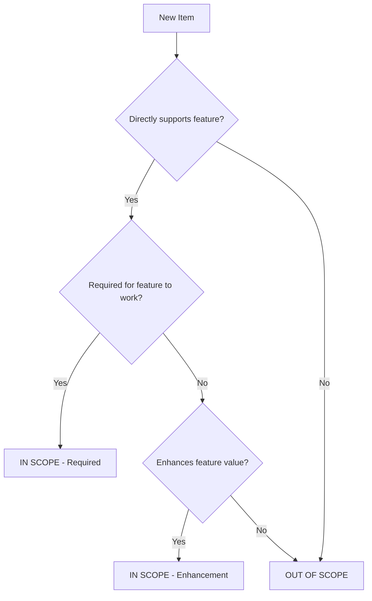

# Technical Specification

# 0. Agent Action Plan

## 0.1 Intent Clarification

### 0.1.1 Core Feature Objective

Based on the prompt, the Blitzy platform has identified a **critical issue with the user-provided input**: The submitted feature requirement consists entirely of placeholder text ("Describe the new functionality you'd like to add to your existing codebase") repeated multiple times. This does not constitute an actionable feature specification.

**Analysis of User Input:**
- The input contains HTML-styled spans with color formatting
- The phrase "Describe the new functionality you'd like to add to your existing codebase" is repeated approximately 400+ times
- No actual feature requirements, user stories, or technical specifications are present
- No Figma URLs, attachments, or supplementary materials were provided

**Implicit Requirements Detected:**
- The user intends to add new functionality to an existing Node.js HTTP server application
- The target repository is a minimal "hello-world-nodejs" educational application
- The codebase uses only Node.js built-in modules with zero external dependencies

**Feature Dependencies and Prerequisites:**
- Base application requires Node.js ≥14.0.0
- Current runtime environment: Node.js v20.19.6, npm 11.1.0
- No package.json exists in the repository (dependency manifest absent)

### 0.1.2 Special Instructions and Constraints

**CRITICAL: Missing Information Required**

The following information must be provided to proceed with feature implementation:

| Required Information | Description | Example |
|---------------------|-------------|---------|
| Feature Name | Clear identifier for the new functionality | "User Authentication System" |
| Feature Description | Detailed explanation of what the feature should do | "Allow users to register, login, and maintain sessions" |
| User Stories | Who uses this and why | "As a user, I want to login so I can access protected resources" |
| Technical Constraints | Any specific patterns or technologies to use | "Must use JWT for authentication" |
| Integration Points | How it connects to existing code | "Integrate with existing HTTP request handler" |
| Acceptance Criteria | How to verify the feature works | "User can login with valid credentials and receive a token" |

**Architectural Requirements Observed from Existing Repository:**
- Maintain zero-dependency philosophy (if applicable)
- Follow single-file simplicity pattern (or define new modular structure)
- Preserve educational accessibility as a core value

**Web Search Requirements:**
- None identified (no specific technologies or patterns mentioned in user input)

### 0.1.3 Technical Interpretation

**Current State Analysis:**

The existing repository consists of a single `server.js` file implementing a minimal HTTP server:

```javascript
const http = require('http');
const server = http.createServer((req, res) => {
  res.end('Hello, World!\n');
});
```

**These feature requirements translate to the following technical implementation strategy:**

Since no actual feature requirements were specified, the Blitzy platform cannot determine specific technical actions. However, based on common feature addition patterns for Node.js HTTP servers, potential implementations could include:

- To **add routing capabilities**, we will create/modify `server.js` to include URL path parsing and route handlers
- To **add API endpoints**, we will extend the request handler to inspect `req.url` and `req.method`
- To **add configuration management**, we will create environment variable support or configuration files
- To **add database connectivity**, we will introduce database client dependencies and connection handling
- To **add authentication**, we will implement middleware-style request interception with token validation

**Action Required:** The user must provide specific feature requirements to proceed with implementation planning.

## 0.2 Repository Scope Discovery

### 0.2.1 Comprehensive File Analysis

**Current Repository Structure:**

The repository contains a minimal file structure with only one source file:

```
hello-world-nodejs/
├── .git/                    # Git version control directory
└── server.js                # Single source file (342 bytes, 15 lines)
```

**Existing Files Inventory:**

| File Path | Type | Size | Purpose |
|-----------|------|------|---------|
| server.js | JavaScript | 342 bytes | HTTP server implementation using Node.js built-in `http` module |

**Search Patterns Applied:**

| Pattern | Files Found | Notes |
|---------|-------------|-------|
| `**/*.js` | 1 (server.js) | Only source file |
| `**/*.json` | 0 | No package.json or configuration files |
| `**/*.yaml`, `**/*.yml` | 0 | No configuration files |
| `**/*.md` | 0 | No documentation files |
| `**/*.config.*` | 0 | No configuration files |
| `**/test*`, `**/*spec*` | 0 | No test files |
| `Dockerfile*`, `docker-compose*` | 0 | No container configurations |
| `.github/workflows/*` | 0 | No CI/CD pipelines |

**Integration Point Discovery:**

| Integration Category | Existing Components | Status |
|---------------------|---------------------|--------|
| API Endpoints | Single handler (all requests → "Hello, World!") | Requires creation |
| Database Models | None | Requires creation |
| Service Classes | None | Requires creation |
| Controllers/Handlers | Inline anonymous function in `http.createServer()` | Modification point |
| Middleware | None | Requires creation |
| Configuration | Hardcoded `hostname` and `port` constants | Enhancement target |

### 0.2.2 Existing Code Analysis

**server.js - Complete Analysis:**

```javascript
// Line 1: Module import - only external dependency
const http = require('http');

// Lines 3-4: Configuration constants (hardcoded)
const hostname = '127.0.0.1';
const port = 3000;

// Lines 6-10: Server creation with request handler
// Note: Handler ignores req object entirely
const server = http.createServer((req, res) => {
  res.statusCode = 200;
  res.setHeader('Content-Type', 'text/plain');
  res.end('Hello, World!\n');
});
```

**Key Observations:**
- No request inspection (`req.url`, `req.method`, `req.headers` unused)
- No error handling for server or request lifecycle
- No graceful shutdown mechanism
- Single-response handler (no routing logic)
- Synchronous response generation (no async operations)

### 0.2.3 Web Search Research Conducted

No web search was conducted as the user input did not specify:
- Any particular feature type requiring best practices research
- Specific libraries or frameworks to evaluate
- Integration patterns to investigate
- Security considerations for specific functionality

### 0.2.4 New File Requirements

**Note:** Without specific feature requirements, the following represents a **generic template** for common Node.js feature additions:

**Potential New Source Files:**
- `src/routes/index.js` - Route definitions and handlers
- `src/controllers/[feature]Controller.js` - Request handling logic
- `src/services/[feature]Service.js` - Business logic layer
- `src/models/[feature]Model.js` - Data structures and validation
- `src/middleware/[feature]Middleware.js` - Request processing middleware
- `src/config/index.js` - Configuration management
- `src/utils/logger.js` - Logging utilities

**Potential New Test Files:**
- `tests/unit/[feature].test.js` - Unit test coverage
- `tests/integration/[feature].integration.test.js` - Integration scenarios
- `tests/e2e/[feature].e2e.test.js` - End-to-end testing

**Potential New Configuration Files:**
- `package.json` - Dependency manifest and scripts
- `.env.example` - Environment variable template
- `config/default.json` - Default configuration values
- `.eslintrc.js` - Code linting configuration
- `jest.config.js` - Test runner configuration

**Action Required:** Specific file requirements will be determined once feature specifications are provided.

## 0.3 Dependency Inventory

### 0.3.1 Private and Public Packages

**Current Dependency State:**

The repository has **zero dependencies** - no `package.json` exists, and the application relies solely on Node.js built-in modules.

**Existing Built-in Module Usage:**

| Module | Source | Version | Purpose |
|--------|--------|---------|---------|
| http | Node.js built-in | (bundled with Node.js) | HTTP server creation and request handling |

**Dependency Manifest Status:**

| File | Status | Action Required |
|------|--------|-----------------|
| package.json | Missing | Create if external dependencies needed |
| package-lock.json | Missing | Generate after npm install |
| node_modules/ | Missing | Not required for current implementation |

### 0.3.2 Potential Dependencies for Common Features

**Note:** The following dependencies are **not yet required** but represent common additions based on feature type:

**Web Framework Dependencies (if routing/API features needed):**

| Package Registry | Name | Latest Stable | Purpose |
|-----------------|------|---------------|---------|
| npm | express | ^4.18.2 | Web framework for routing and middleware |
| npm | fastify | ^4.24.3 | High-performance web framework alternative |
| npm | koa | ^2.14.2 | Lightweight middleware-based framework |

**Database Dependencies (if data persistence needed):**

| Package Registry | Name | Latest Stable | Purpose |
|-----------------|------|---------------|---------|
| npm | mongoose | ^8.0.0 | MongoDB ODM |
| npm | pg | ^8.11.3 | PostgreSQL client |
| npm | better-sqlite3 | ^9.2.2 | SQLite3 bindings |

**Authentication Dependencies (if auth needed):**

| Package Registry | Name | Latest Stable | Purpose |
|-----------------|------|---------------|---------|
| npm | jsonwebtoken | ^9.0.2 | JWT creation and verification |
| npm | bcrypt | ^5.1.1 | Password hashing |
| npm | passport | ^0.7.0 | Authentication middleware |

**Testing Dependencies (if test coverage needed):**

| Package Registry | Name | Latest Stable | Purpose |
|-----------------|------|---------------|---------|
| npm | jest | ^29.7.0 | Testing framework |
| npm | supertest | ^6.3.3 | HTTP assertions |
| npm | mocha | ^10.2.0 | Alternative test framework |

### 0.3.3 Dependency Updates

**Import Updates (Not Applicable):**

Since the repository contains only one file with one import (`const http = require('http')`), no import transformations are required for the current state.

**Future Import Pattern Transformation:**

If the application is modularized, imports should follow this pattern:

| Scenario | Old Pattern | New Pattern |
|----------|-------------|-------------|
| Current | `const http = require('http')` | Unchanged if using CommonJS |
| ES Modules | `const http = require('http')` | `import http from 'http'` |
| Framework | Direct http usage | `import express from 'express'` |

**External Reference Updates:**

| File Type | Current State | Update When |
|-----------|---------------|-------------|
| package.json | Does not exist | Features require external dependencies |
| .env | Does not exist | Configuration externalization needed |
| docker-compose.yml | Does not exist | Containerization required |
| .github/workflows/*.yml | Does not exist | CI/CD pipeline needed |

### 0.3.4 Environment Configuration

**Runtime Environment Verified:**

| Component | Required Version | Installed Version | Status |
|-----------|-----------------|-------------------|--------|
| Node.js | ≥14.0.0 | v20.19.6 | ✅ Compatible |
| npm | (any) | 11.1.0 | ✅ Available |

**No Additional Setup Required:**
- No package installation needed for current implementation
- No virtual environment required (Node.js applications use node_modules)
- No build step required (plain JavaScript without transpilation)

**Action Required:** Dependency list will be finalized once specific feature requirements are provided.

## 0.4 Integration Analysis

### 0.4.1 Existing Code Touchpoints

**Primary Integration Point - server.js:**

The entire application consists of a single file with specific integration opportunities:

| Line(s) | Code Element | Integration Opportunity |
|---------|-------------|------------------------|
| 1 | `const http = require('http')` | Add additional module imports |
| 3-4 | Configuration constants | Replace with environment variables or config system |
| 6-10 | `http.createServer()` handler | Primary modification point for request handling |
| 12-14 | `server.listen()` call | Add error handling, startup logic |

**Request Handler Analysis:**

```javascript
// Current handler (Lines 6-10)
const server = http.createServer((req, res) => {
  res.statusCode = 200;
  res.setHeader('Content-Type', 'text/plain');
  res.end('Hello, World!\n');
});
```

**Integration Points Within Handler:**

| Aspect | Current Behavior | Integration Requirement |
|--------|-----------------|------------------------|
| Request URL | Ignored | Parse `req.url` for routing |
| Request Method | Ignored | Check `req.method` for REST semantics |
| Request Headers | Ignored | Inspect `req.headers` for auth/content-type |
| Request Body | Ignored | Implement body parsing for POST/PUT |
| Response Code | Always 200 | Dynamic status codes based on outcome |
| Response Type | Always text/plain | Support JSON, HTML, etc. |
| Response Body | Static string | Dynamic content generation |

### 0.4.2 Direct Modifications Required

**Note:** Specific modifications depend on feature requirements. The following represents the modification framework:

**server.js Modifications:**

| Modification | Location | Purpose |
|--------------|----------|---------|
| Module imports | Line 1 (after) | Add required dependencies |
| Configuration | Lines 3-4 | Replace hardcoded values |
| Handler logic | Lines 6-10 | Implement feature functionality |
| Error handling | New (after line 10) | Add error middleware/handlers |
| Startup logic | Lines 12-14 | Enhanced initialization |

**Potential Handler Structure After Feature Addition:**

```javascript
// Conceptual structure (not implementation)
const server = http.createServer((req, res) => {
  // 1. Route matching
  // 2. Middleware execution
  // 3. Request validation
  // 4. Business logic
  // 5. Response formatting
  // 6. Error handling
});
```

### 0.4.3 Dependency Injections

**Current State:** No dependency injection pattern exists. The application uses direct module imports and inline logic.

**Recommended Integration Pattern:**

| Component | Integration Method | Notes |
|-----------|-------------------|-------|
| Routes | Function composition | Modular route handlers |
| Services | Module imports | Separate business logic |
| Configuration | Environment loading | Centralized config management |
| Middleware | Higher-order functions | Request processing chain |
| Logging | Singleton pattern | Consistent logging across modules |

### 0.4.4 Database/Schema Updates

**Current State:** No database connectivity exists in the application.

**If Database Integration Required:**

| Task | Files Affected | Purpose |
|------|---------------|---------|
| Connection setup | `src/db/connection.js` (new) | Database client initialization |
| Schema definition | `src/models/*.js` (new) | Data structure definitions |
| Migrations | `migrations/*.sql` (new) | Schema version management |
| Seed data | `seeds/*.js` (new) | Initial data population |

**Integration Points for Database:**
- Server startup: Initialize database connection before `server.listen()`
- Request handler: Execute queries within handler or service layer
- Server shutdown: Gracefully close database connections

### 0.4.5 External Service Integration

**Current State:** No external service integrations exist.

**Potential Integration Categories:**

| Category | Examples | Integration Pattern |
|----------|----------|---------------------|
| Authentication | OAuth providers, JWT validation | Middleware + service layer |
| Storage | S3, cloud storage | Service layer abstraction |
| Messaging | Email, SMS, push notifications | Async service calls |
| Monitoring | APM, error tracking | Middleware + startup hooks |
| Caching | Redis, in-memory cache | Service layer with fallback |

**Action Required:** Specific integration requirements will be determined once feature specifications are provided.

## 0.5 Technical Implementation

### 0.5.1 File-by-File Execution Plan

**CRITICAL NOTICE:** No specific feature requirements were provided. The following represents a **generic implementation framework** that will be customized once actual requirements are specified.

**Group 1 - Core Feature Files (Template):**

| Action | File Path | Purpose |
|--------|-----------|---------|
| MODIFY | server.js | Integrate new feature with existing HTTP server |
| CREATE | src/features/[feature]/index.js | Feature entry point and exports |
| CREATE | src/features/[feature]/handler.js | Request handling logic |
| CREATE | src/features/[feature]/service.js | Business logic implementation |

**Group 2 - Supporting Infrastructure (Template):**

| Action | File Path | Purpose |
|--------|-----------|---------|
| CREATE | package.json | Dependency management and npm scripts |
| CREATE | src/config/index.js | Configuration management |
| CREATE | src/middleware/errorHandler.js | Centralized error handling |
| CREATE | src/utils/logger.js | Logging utilities |

**Group 3 - Tests and Documentation (Template):**

| Action | File Path | Purpose |
|--------|-----------|---------|
| CREATE | tests/[feature].test.js | Unit test coverage |
| CREATE | tests/integration/[feature].test.js | Integration test scenarios |
| CREATE | README.md | Project documentation |
| CREATE | docs/[feature].md | Feature-specific documentation |

### 0.5.2 Implementation Approach per File

**Phase 1: Foundation Setup**

| Step | Action | Files | Description |
|------|--------|-------|-------------|
| 1.1 | Initialize npm | package.json | Create dependency manifest |
| 1.2 | Setup configuration | src/config/* | Environment and settings management |
| 1.3 | Add logging | src/utils/logger.js | Consistent logging capability |

**Phase 2: Core Implementation**

| Step | Action | Files | Description |
|------|--------|-------|-------------|
| 2.1 | Create feature module | src/features/[feature]/* | Implement feature logic |
| 2.2 | Modify server | server.js | Integrate feature with HTTP server |
| 2.3 | Add error handling | src/middleware/* | Robust error management |

**Phase 3: Quality Assurance**

| Step | Action | Files | Description |
|------|--------|-------|-------------|
| 3.1 | Write unit tests | tests/unit/* | Test individual components |
| 3.2 | Write integration tests | tests/integration/* | Test component interactions |
| 3.3 | Document feature | docs/*, README.md | Usage and API documentation |

### 0.5.3 Server.js Modification Strategy

**Current Implementation (Before):**

```javascript
const http = require('http');
const hostname = '127.0.0.1';
const port = 3000;
// ... handler and listen
```

**Conceptual Implementation (After Feature Addition):**

```javascript
const http = require('http');
const config = require('./src/config');
const handler = require('./src/handler');
const server = http.createServer(handler);
```

**Key Modifications:**
- Extract configuration to external module
- Replace inline handler with imported module
- Add error handling and graceful shutdown
- Implement startup validation

### 0.5.4 User Interface Design

**Status:** No Figma URLs or UI designs were provided.

**UI Requirements:**
- No user interface specifications received
- No visual design references available
- No component mockups to analyze

**If UI Required (Template Actions):**
- Analyze Figma designs using provided tools
- Extract design tokens and styling requirements
- Document component hierarchy and interactions
- Map UI elements to backend API requirements

### 0.5.5 Implementation Validation Criteria

**Generic Validation Framework:**

| Criterion | Validation Method | Pass Condition |
|-----------|------------------|----------------|
| Functionality | Manual testing + automated tests | Feature works as specified |
| Integration | Integration tests | No regression in existing behavior |
| Performance | Load testing | Meets response time requirements |
| Security | Security review | No vulnerabilities introduced |
| Documentation | Review | Feature is fully documented |

**Action Required:** Specific implementation details and validation criteria will be defined once feature specifications are provided.

## 0.6 Scope Boundaries

### 0.6.1 Exhaustively In Scope

**CRITICAL NOTICE:** Without specific feature requirements, the scope cannot be definitively determined. The following represents the **baseline in-scope items** based on repository analysis:

**Existing Files (Confirmed In Scope):**

| Pattern | Files | Scope Status |
|---------|-------|--------------|
| server.js | 1 file | ✅ Primary modification target |
| .git/* | Version control | ✅ Maintain for version history |

**Potential In-Scope Items (Pending Feature Definition):**

**Source Files:**
- `server.js` - Primary integration point
- `src/**/*.js` - All new feature source files
- `src/features/[feature]/**/*` - Feature-specific modules
- `src/config/**/*` - Configuration files
- `src/middleware/**/*` - Middleware components
- `src/utils/**/*` - Utility functions

**Test Files:**
- `tests/**/*.test.js` - All test files
- `tests/unit/**/*` - Unit tests
- `tests/integration/**/*` - Integration tests
- `tests/e2e/**/*` - End-to-end tests

**Configuration Files:**
- `package.json` - Dependency manifest
- `package-lock.json` - Dependency lock file
- `.env.example` - Environment variable template
- `config/**/*` - Configuration settings
- `.eslintrc.*` - Linting configuration
- `jest.config.js` - Test configuration

**Documentation Files:**
- `README.md` - Project readme
- `docs/**/*.md` - Feature documentation
- `docs/api/**/*` - API documentation
- `CHANGELOG.md` - Version history

**Infrastructure Files:**
- `Dockerfile` - Container configuration
- `docker-compose.yml` - Multi-container setup
- `.github/workflows/**/*` - CI/CD pipelines
- `.gitignore` - Git ignore patterns

### 0.6.2 Explicitly Out of Scope

**Confirmed Out of Scope:**

| Item | Reason |
|------|--------|
| Unrelated existing projects | Only this repository is targeted |
| System-level Node.js changes | Application-level changes only |
| Operating system configurations | Cross-platform compatibility maintained |
| External service subscriptions | Beyond code implementation scope |

**Out of Scope Unless Explicitly Required:**

| Item | Condition for Inclusion |
|------|------------------------|
| Performance optimizations | Only if specified in requirements |
| Database migrations | Only if data persistence required |
| Authentication system | Only if security features required |
| Monitoring integration | Only if observability required |
| Containerization | Only if deployment requirements specify |
| CI/CD pipelines | Only if automation required |
| Code refactoring | Only changes directly supporting new feature |
| Third-party integrations | Only if specified in requirements |

### 0.6.3 Scope Decision Matrix

**Decision Framework for Scope Inclusion:**



**Scope Categories:**

| Category | Description | Examples |
|----------|-------------|----------|
| Required | Must be implemented for feature to function | Core feature files, direct integration points |
| Enhancement | Improves feature but not strictly required | Additional validation, extended error handling |
| Optional | Nice-to-have additions | Performance optimizations, additional logging |
| Out of Scope | Not related to current feature | Unrelated refactoring, new unspecified features |

### 0.6.4 File Scope Summary Table

| Scope Level | File Pattern | Count | Notes |
|-------------|--------------|-------|-------|
| Definite | server.js | 1 | Existing file requiring modification |
| Likely | src/**/*.js | TBD | New feature source files |
| Likely | tests/**/*.js | TBD | Test coverage files |
| Conditional | package.json | 1 | If dependencies needed |
| Conditional | config/**/* | TBD | If configuration externalized |
| Conditional | docs/**/*.md | TBD | If documentation required |
| Excluded | Unrelated files | N/A | Any files not supporting feature |

**Action Required:** Complete scope boundaries will be finalized once specific feature requirements are provided.

## 0.7 Rules for Feature Addition

### 0.7.1 User-Specified Rules

**Status:** No specific rules, constraints, or requirements were provided by the user.

The user input consisted entirely of placeholder text without any:
- Coding standards or conventions to follow
- Integration requirements with existing features
- Performance or scalability considerations
- Security requirements specific to the feature
- Architectural constraints or preferences
- Technology stack requirements or restrictions

### 0.7.2 Repository-Derived Rules

Based on analysis of the existing codebase, the following implicit rules have been identified:

**Code Style Rules:**

| Rule | Source | Guideline |
|------|--------|-----------|
| Module System | server.js line 1 | Use CommonJS (`require`/`module.exports`) unless ES Modules specified |
| Variable Declaration | server.js lines 3-4 | Use `const` for immutable bindings |
| String Format | server.js line 9 | Use single quotes for strings |
| Semicolons | server.js (all lines) | Include semicolons at end of statements |
| Indentation | server.js | Use 2-space indentation |

**Architectural Rules:**

| Rule | Source | Guideline |
|------|--------|-----------|
| Simplicity | Project philosophy | Maintain educational simplicity where possible |
| Zero Dependencies | Current state | Preserve zero-dependency model unless feature requires external packages |
| Single Entry Point | server.js | Main entry point remains server.js |
| Built-in Modules | http module usage | Prefer Node.js built-in modules when sufficient |

**Operational Rules:**

| Rule | Source | Guideline |
|------|--------|-----------|
| Port Binding | server.js line 4 | Default port 3000 unless configured otherwise |
| Interface Binding | server.js line 3 | Default to localhost (127.0.0.1) for security |
| Startup Logging | server.js lines 12-14 | Log server URL on successful startup |

### 0.7.3 Standard Feature Addition Guidelines

**General Best Practices (Apply Unless Contradicted by User Requirements):**

**Code Quality:**
- Write clean, readable, and maintainable code
- Follow single responsibility principle for modules
- Include meaningful comments for complex logic
- Use descriptive variable and function names

**Error Handling:**
- Implement proper error handling for all new functionality
- Provide meaningful error messages
- Log errors appropriately for debugging
- Handle edge cases gracefully

**Security:**
- Validate all user inputs
- Sanitize data before processing
- Follow principle of least privilege
- Avoid exposing sensitive information in logs or responses

**Testing:**
- Write unit tests for new functions
- Include integration tests for feature workflows
- Aim for meaningful test coverage (not just percentage)
- Test error cases and edge conditions

**Documentation:**
- Document public APIs and interfaces
- Include usage examples
- Update README if feature affects user experience
- Maintain changelog for version tracking

### 0.7.4 Compatibility Rules

**Node.js Version Compatibility:**

| Constraint | Value | Source |
|------------|-------|--------|
| Minimum Version | Node.js ≥14.0.0 | Tech spec section 3.3.2 |
| Target Environment | Node.js 20.x | Current runtime |
| ES Features | ES2020+ supported | Node.js 14+ compatibility |

**Module Compatibility:**

| Aspect | Guideline |
|--------|-----------|
| CommonJS | Default module system (existing pattern) |
| ES Modules | May be used if package.json specifies `"type": "module"` |
| Mixed | Avoid mixing module systems in same project |

**Action Required:** User-specified rules will be documented once feature requirements with explicit constraints are provided.

## 0.8 References

### 0.8.1 Repository Files Analyzed

**Files Retrieved and Analyzed:**

| File Path | Type | Analysis Purpose | Key Findings |
|-----------|------|------------------|--------------|
| server.js | JavaScript | Primary source analysis | 15-line HTTP server using built-in http module; handles all requests with static "Hello, World!" response |

**Folder Structure Explored:**

| Path | Level | Contents Found |
|------|-------|----------------|
| / (root) | 0 | server.js, .git/ |
| .git/ | 1 | Git version control (not analyzed for content) |

**Files Not Found (Searched But Absent):**

| File Pattern | Purpose | Status |
|--------------|---------|--------|
| package.json | Dependency manifest | Not present |
| package-lock.json | Dependency lock | Not present |
| *.yaml, *.yml | Configuration | Not present |
| *.md | Documentation | Not present |
| tests/**/* | Test files | Not present |
| .env* | Environment config | Not present |
| Dockerfile | Container config | Not present |
| .github/**/* | CI/CD config | Not present |
| .blitzyignore | Ignore patterns | Not present |

### 0.8.2 Technical Specification Sections Referenced

| Section | Heading | Information Obtained |
|---------|---------|---------------------|
| 1.1 | Executive Summary | Project overview as educational Node.js HTTP server |
| 1.3 | Scope | In-scope and out-of-scope features documentation |
| 3.3 | Runtime Environment | Node.js platform requirements (≥14.0.0) |

### 0.8.3 User-Provided Attachments

**Status:** No attachments were provided by the user.

| Attachment Type | Files Provided | Summary |
|----------------|----------------|---------|
| Documents | None | N/A |
| Code files | None | N/A |
| Configuration files | None | N/A |
| Images | None | N/A |
| Other | None | N/A |

**Attachment Directory Check:**
- Path checked: `/tmp/environments_files`
- Result: No relevant files found

### 0.8.4 Figma Design References

**Status:** No Figma URLs were provided by the user.

| Frame Name | URL | Description |
|------------|-----|-------------|
| (none) | (none) | No Figma designs referenced |

### 0.8.5 External Resources

**Web Searches Conducted:**
- None required (no specific technologies or patterns specified in user input)

**External Documentation Referenced:**
- Node.js HTTP module documentation (implicit, based on existing code analysis)

### 0.8.6 Environment Information

**Runtime Environment Verified:**

| Component | Version | Verification Method |
|-----------|---------|---------------------|
| Node.js | v20.19.6 | `node --version` |
| npm | 11.1.0 | `npm --version` |
| Operating System | Linux | bash environment |

**Environment Setup Status:**

| Item | Status | Notes |
|------|--------|-------|
| User setup instructions | None provided | No custom setup required |
| Environment variables | None provided | Empty list received |
| Secrets | None provided | Empty list received |
| Private dependencies | None specified | No private packages to install |

### 0.8.7 Analysis Summary

**Key Conclusions:**

1. **User Input Issue:** The provided feature requirements consist of placeholder text repeated multiple times, containing no actionable specifications.

2. **Repository State:** Minimal Node.js repository with single `server.js` file implementing basic HTTP server.

3. **Missing Information Required:**
   - Specific feature name and description
   - Detailed requirements and user stories
   - Technical constraints and preferences
   - Integration requirements
   - Acceptance criteria

4. **Recommendation:** User should provide complete feature specifications to enable proper Agent Action Plan generation.

